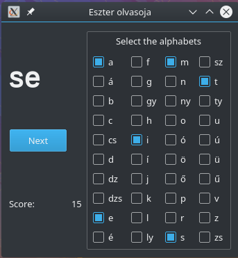

# readingPractise

Wrote this for my 6-year-old daughter who just started to learn how to read.
Alphabets she already know can be selected and the software will randomly put two together.
Score is increasing by reading new "words".
After every 50 points the amount of alphabets will inreasing by still using only selected ones.
Also the default browser will opens and plays pre-selected videos as a reward.

